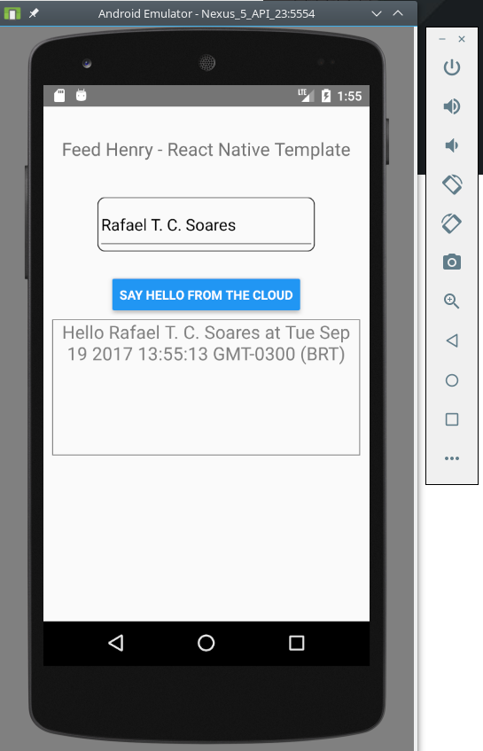

## Instructions for Android

## Local Environment setup
You have to setup the following tools before you can perform the other steps.

 * React Native CLI
  * requires:
    * NodeJS (>= 6.x)
    * npm
 * Android SDK and emulator
 * requires:
   * Java Runtime
   * Gradle

We suggest you follow the official [**React Native Getting Started Guide**](https://facebook.github.io/react-native/docs/getting-started.html) instructions to get it right!

### 1. Create your React Native Project
Do it as usual, for example: ``$ react-native init Test001 ``

Next an example output of the previous command.

```shell
react-native init HelloWorld
This will walk you through creating a new React Native project in /home/rsoares/Workshops/RH-MAP/projects/samples/reactive-native/rct-fh-poc/HelloWorld
Installing react-native...
Consider installing yarn to make this faster: https://yarnpkg.com

...

Setting up new React Native app in /home/rsoares/Workshops/RH-MAP/projects/samples/reactive-native/rct-fh-poc/HelloWorld
Installing React...
HelloWorld@0.0.1 /home/rsoares/Workshops/RH-MAP/projects/samples/reactive-native/rct-fh-poc/HelloWorld
└── react@16.0.0-alpha.12

...

To run your app on iOS:
   cd /home/rsoares/Workshops/RH-MAP/projects/samples/reactive-native/rct-fh-poc/HelloWorld
   react-native run-ios
   - or -
   Open ios/HelloWorld.xcodeproj in Xcode
   Hit the Run button
To run your app on Android:
   cd /home/rsoares/Workshops/RH-MAP/projects/samples/reactive-native/rct-fh-poc/HelloWorld
   Have an Android emulator running (quickest way to get started), or a device connected
   react-native run-android


```

### 2. Add 'rct-fh' dependency
Using npm: ``npm install rct-fh --save``

Underneath the output using npm.

```shell
cd HelloWorld

npm install https://github.com/rafaeltuelho/RCTFH.git --save

> rct-fh@0.0.18 postinstall /home/rsoares/Workshops/RH-MAP/projects/samples/reactive-native/rct-fh-poc/HelloWorld/node_modules/rct-fh
> ./update-links.sh

HelloWorld@0.0.1 /home/rsoares/Workshops/RH-MAP/projects/samples/reactive-native/rct-fh-poc/HelloWorld
└── rct-fh@0.0.18  (git+https://github.com/rafaeltuelho/RCTFH.git#3326de4f0f9a3a2c31b4f4ce7b6695a8c687473f)

```

> note the `--save` flag on `npm install` command! This is important because on next step `react-native link` uses the dependencies declared on `packages.json` file.

### 3. Let's link the new module
To do so, let's use: ``react-native link`` as in the following test.

> See the [*Linking Libraries*](https://facebook.github.io/react-native/docs/linking-libraries-ios.html) doc page on React Native User Guide for more details on this step.

```shell
react-native link                                           
Scanning 574 folders for symlinks in /home/rsoares/Workshops/RH-MAP/projects/samples/reactive-native/rct-fh-poc/HelloWorld/node_modules (5ms)
rnpm-install info Linking rct-fh android dependency
rnpm-install info Android module rct-fh has been successfully linked
rnpm-install info Linking rct-fh ios dependency
rnpm-install info iOS module rct-fh has been successfully linked

```

### 4. Create the RHMAP Android configuration file

In order to communicate with RHMAP Cloud Apps you have to provide a configuration file specific for your target platform:
 * [Server Connection setup for Android](https://access.redhat.com/documentation/en-us/red_hat_mobile_application_platform_hosted/3/html/client_sdk/native-android#rhmap_server_connection_setup)

Below you'll find an example of `fhconfig.properties` file.

```json
host = https://<your rhmap sub-domain>.us.demos.redhatmobile.com
appid = <appid copied from RHMAP Studio Client page>
projectid = <projectid copied from RHMAP Studio project settings'  page>
appkey = <appkey copied from RHMAP Studio Client page>
connectiontag = 0.0.8
```

For Android this file needs to be created under: `$RCT_PROJECT_HOME/android/app/src/main/assets/`.
Create this file  using any text editor or your preferred IDE.


### 5. Using the module
Below you'll find an example of ``index.android.js`` that uses our module ``rct-fh``. Please pay attention to the class name exported (HelloWorld in our example) and also to the name of the app registered in the last line (again HelloWorld in our example). For simplicity make the name of both the class and the component registered to be the name of the React Native application we used in **step #1** where we run ``react-native init <App Name>``.

#### 5.1 Importing the module
To import the module, just require `rct-fh` (or the `rct-fh/RCTFH.android` as explained [here](./README.md)).

```js
var RCTFH = require('rct-fh');
```
The excerpt below shows how we're defining an object exposing native module methods asynchronously. See [index.js](./index.js) for more details.

```js
RCTFH.prototype.init = async function () {
  return await this.fh.init();
};
RCTFH.prototype.auth = async function (authPolicy, username, password) {
  return await this.fh.auth(authPolicy, username, password);
};
RCTFH.prototype.cloud = async function (options) {
  return await this.fh.cloud(options);
};
```

#### 5.2 Init the module
The function to initialize the module is: ``RCTFH.init()``. This function is asynchronous and as such we could use the [keyword `await`](https://developer.mozilla.org/en-US/docs/Web/JavaScript/Reference/Operators/await) to asynchronously await for the init process to finish (in the same fashion as ``then`` in a Promise). As you can see below, once the init process has ``resolved`` properly we get the ``result`` object. On the other hand if there is a problem while initializing the module the init process will be ``rejected`` and hence the ``catch`` code will be fired.

```js
try {
	this.setState({message: 'Initializing...'});
	const result = await RCTFH.init();
	console.log('init result', result);
	this.setState({message: 'Ready'});

	if (result === 'SUCCESS') {
	  console.log('SUCCESS');
	  this.setState({init: true});
	} else {
	  console.error('Error');
	}
} catch (e) {
	console.error('Exception', e);
}
```

#### 5.3 Authentication
Before we can use this function we need to have defined an authentication policy in RHMAP Studio. For more information about authentication policies please go to [RHMAP Auth Policies](https://access.redhat.com/documentation/en-us/red_hat_mobile_application_platform_hosted/3/html/product_features/product-features-administration-and-management#auth-policies).

The function to trigger an authentication policy is: ``RCTFH.auth()``. This function is also asynchronous and as such we could use the [keyword `await`](https://developer.mozilla.org/en-US/docs/Web/JavaScript/Reference/Operators/await) to asynchronously await for the authentication process to finish. If the policy is invoked properly we will get a ``result`` object, if the credentials provided are correct the object will include a ``sessionToken`` attribute. On the other hand if there is a problem the function will be ``rejected`` and hence the ``catch`` code will be fired.

```js
try {
	const result = await RCTFH.auth(authPolicy, username, password);
	if (typeof result.sessionToken !== 'undefined') {
	  console.log('AUTHENTICATED');
	} else {
	  console.log('UNAUTHENTICATED');
	}
} catch (e) {
	console.error('ERROR', e);
}
```

#### 5.4 REST call, 'cloud' API
The function to call a RESTful endpoint exposed in a FeedHendry Cloud App is: ``RCTFH.cloud(options)``. Again, this function is asynchronous and as such we could use the [keyword `await`](https://developer.mozilla.org/en-US/docs/Web/JavaScript/Reference/Operators/await) to asynchronously await for the cloud call process to finish. In the same fashion as the init call, once the cloud call has ``resolved`` properly we get the ``result`` object and if there is a problem the ``catch`` code will be fired.

As you can see, we are using a set options to use this function:

* ``path`` cloud app endpoint
* ``method`` HTTP method; GET, POST, etc.
* ``contentType`` usually *application/json*
* ``data `` object we want to use along with the HTTP method, in the case of the GET method a flat object is turned into query parameters
* ``timeout `` HTTP timeout

```js
try {
  const result = await RCTFH.cloud({
    "path": "/hello", //only the path part of the url, the host will be added automatically
    "method": "GET", //all other HTTP methods are supported as well. For example, HEAD, DELETE, OPTIONS
    "contentType": "application/json",
    "data": { "hello": this.state.userInput}, //data to send to the server
    "timeout": 25000 // timeout value specified in milliseconds. Default: 60000 (60s)
  });

  if (result && result.msg)
    this.setState({message: result.msg + ' at ' + new Date(parseInt(result.timestamp)});
  else
    this.setState({message: JSON.stringify(result)});
} catch (e) {
  this.setState({message: 'Error' + e});
}
```

A complete example code for Android platform is available [here](https://github.com/rafaeltuelho/quickstart-react-native/blob/master/index.android.js)

### 6 Running your app
Finally you can execute and test your React Native app on your local environment.

If you have the Android SDK with and emulator on your local environment, start it up!

 * first start the React packager server

run the following command on another terminal (inside your React Native project's root dir)
```
npm start
```

something like this output should appears on your console:

```
> HelloWorld@0.0.1 start /home/rsoares/Workshops/RH-MAP/projects/samples/reactive-native/rct-fh-poc/HelloWorld
> node node_modules/react-native/local-cli/cli.js start

Scanning 574 folders for symlinks in /home/rsoares/Workshops/RH-MAP/projects/samples/reactive-native/rct-fh-poc/HelloWorld/node_modules (15ms)
 ┌────────────────────────────────────────────────────────────────────────────┐
 │  Running packager on port 8081.                                            │
 │                                                                            │
 │  Keep this packager running while developing on any JS projects. Feel      │
 │  free to close this tab and run your own packager instance if you          │
 │  prefer.                                                                   │
 │                                                                            │
 │  https://github.com/facebook/react-native                                  │
 │                                                                            │
 └────────────────────────────────────────────────────────────────────────────┘
Looking for JS files in

/home/rsoares/Workshops/RH-MAP/projects/samples/reactive-native/rct-fh-poc/HelloWorld


React packager ready.

Loading dependency graph, done.
```

 * Then, run the following command on another terminal (inside your React Native project's root dir)

```
react-native run-android
Scanning 574 folders for symlinks in /home/rsoares/Workshops/RH-MAP/projects/samples/reactive-native/rct-fh-poc/HelloWorld/node_modules (5ms)
JS server already running.
Building and installing the app on the device (cd android && ./gradlew installDebug)...
Incremental java compilation is an incubating feature.

...

Installing APK 'app-debug.apk' on 'Nexus_5_API_23(AVD) - 6.0' for app:debug
Installed on 1 device.

BUILD SUCCESSFUL

Total time: 5.372 secs
Running /home/rsoares/opt/mobile/android-sdk-linux/platform-tools/adb -s emulator-5554 reverse tcp:8081 tcp:8081
Starting the app on emulator-5554 (/home/rsoares/opt/mobile/android-sdk-linux/platform-tools/adb -s emulator-5554 shell am start -n com.helloworld/com.helloworld.MainActivity)...
Starting: Intent { cmp=com.helloworld/.MainActivity }
```

If everything is ok you should see your app running on the emulator


